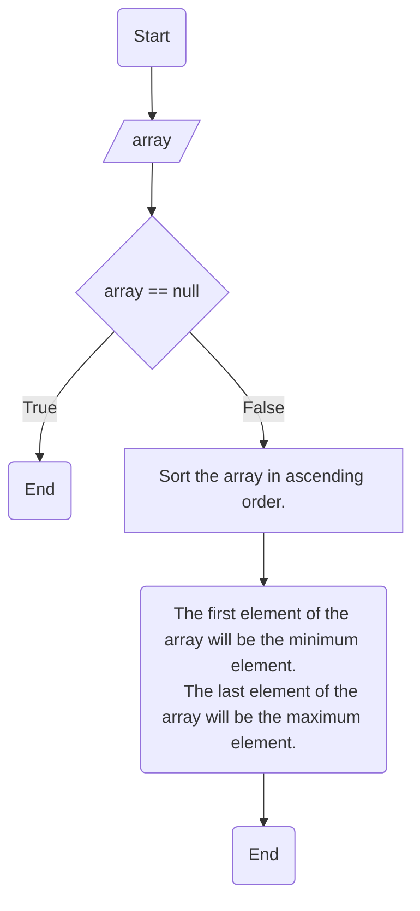

# Maximum and minimum of an array using minimum number of comparisons

```agsl
Input: arr[] = {3, 5, 4, 1, 9}
Output: Minimum element is: 1
Maximum element is: [1, 9]

Input: arr[] = {22, 14, 8, 17, 35, 3}
Output:  Minimum element is: 3
Maximum element is: [3,35]
```

Step-by-step approach:

    Initialize an array.
    Sort the array in ascending order.
    The first element of the array will be the minimum element.
    The last element of the array will be the maximum element.
    Print the minimum and maximum element.



