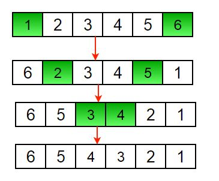
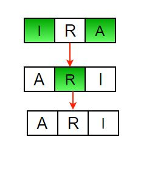

Given an array (or string), the task is to reverse the array/string.
Examples :

```agsl
Input  : arr[] = {1, 2, 3}
```

```agsl
Output : arr[] = {3, 2, 1}
```
```agsl
Input :  arr[] = {4, 5, 1, 2}
```

```agsl
Output : arr[] = {2, 1, 5, 4}
```

Iterative way :

    -1 Initialize start and end indexes as start = 0, end = n-1 
    -2 In a loop, swap arr[start] with arr[end] and change start and end as follows : 
    start = start +1, end = end – 1



Another example to reverse a string:
