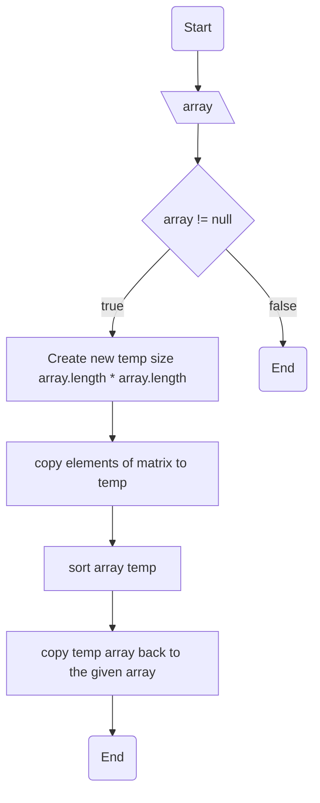

```agsl
Give a n xn matrix. The problem is to sort the given matrix in strict order. Here strict ordermeans
that the matrix is sorted in a way such that all elements in a row are sorted in increasing order and
for row `i`, where i <= i <= n-1, the first element of row `i` is greater than or equal to the last element of row `i -1`
```

Examples:

    Input : mat[][] = { {5, 4, 7}, 
                             {1, 3, 8}, 
                            {2, 9, 6} }
    Output : 1 2 3
                 4 5 6
                 7 8 9


Solution:

```dtd
The idea to solve this problem is create a temp[] array
of size n * n. Starting with the first row one by one copy the elements of the given
mattrix into temp[]. Sort temp[]. Npw one by one copy the elements of
the given matrix into temp[] . Sort temp[]. Nw one by one copy the elements of temp[] back to the given matrix.
```

